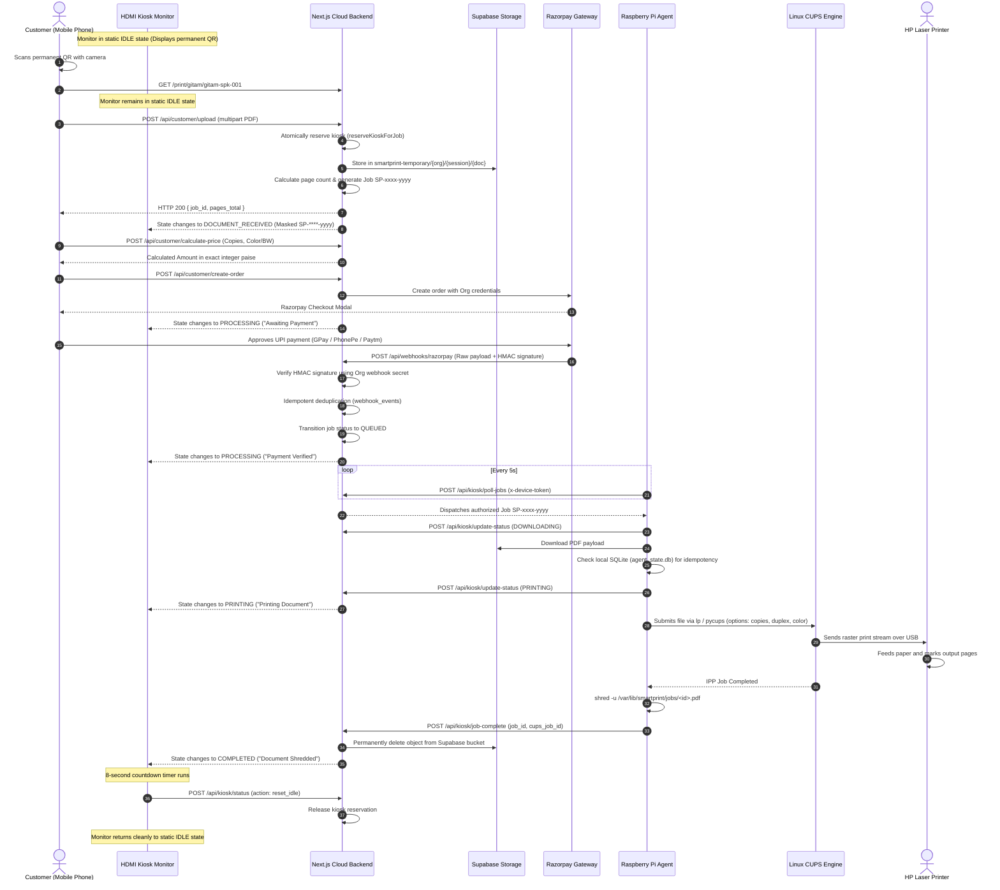

# Customer Upload-to-Print Workflow

```mermaid
sequenceDiagram
    autonumber
    actor Customer as Customer (Mobile Phone)
    participant KioskMon as HDMI Kiosk Monitor
    participant Backend as Next.js Cloud Backend
    participant Storage as Supabase Storage
    participant Razorpay as Razorpay Gateway
    participant PiAgent as Raspberry Pi Agent
    participant CUPS as Linux CUPS Engine
    actor Printer as HP Laser Printer

    Note over KioskMon: Monitor in static IDLE state (Displays permanent QR)
    Customer->>Customer: Scans permanent QR with camera
    Customer->>Backend: GET /print/gitam/gitam-spk-001
    Note over KioskMon: Monitor remains in static IDLE state
    
    Customer->>Backend: POST /api/customer/upload (multipart PDF)
    Backend->>Backend: Atomically reserve kiosk (reserveKioskForJob)
    Backend->>Storage: Store in smartprint-temporary/{org}/{session}/{doc}
    Backend->>Backend: Calculate page count & generate Job SP-xxxx-yyyy
    Backend-->>Customer: HTTP 200 { job_id, pages_total }
    Backend-->>KioskMon: State changes to DOCUMENT_RECEIVED (Masked SP-****-yyyy)
    
    Customer->>Backend: POST /api/customer/calculate-price (Copies, Color/BW)
    Backend-->>Customer: Calculated Amount in exact integer paise
    
    Customer->>Backend: POST /api/customer/create-order
    Backend->>Razorpay: Create order with Org credentials
    Razorpay-->>Customer: Razorpay Checkout Modal
    Backend-->>KioskMon: State changes to PROCESSING ("Awaiting Payment")
    
    Customer->>Razorpay: Approves UPI payment (GPay / PhonePe / Paytm)
    Razorpay->>Backend: POST /api/webhooks/razorpay (Raw payload + HMAC signature)
    Backend->>Backend: Verify HMAC signature using Org webhook secret
    Backend->>Backend: Idempotent deduplication (webhook_events)
    Backend->>Backend: Transition job status to QUEUED
    Backend-->>KioskMon: State changes to PROCESSING ("Payment Verified")
    
    loop Every 5s
        PiAgent->>Backend: POST /api/kiosk/poll-jobs (x-device-token)
    end
    Backend-->>PiAgent: Dispatches authorized Job SP-xxxx-yyyy
    PiAgent->>Backend: POST /api/kiosk/update-status (DOWNLOADING)
    PiAgent->>Storage: Download PDF payload
    PiAgent->>PiAgent: Check local SQLite (agent_state.db) for idempotency
    
    PiAgent->>Backend: POST /api/kiosk/update-status (PRINTING)
    Backend-->>KioskMon: State changes to PRINTING ("Printing Document")
    PiAgent->>CUPS: Submits file via lp / pycups (options: copies, duplex, color)
    CUPS->>Printer: Sends raster print stream over USB
    Printer->>Printer: Feeds paper and marks output pages
    
    CUPS-->>PiAgent: IPP Job Completed
    PiAgent->>PiAgent: shred -u /var/lib/smartprint/jobs/<id>.pdf
    PiAgent->>Backend: POST /api/kiosk/job-complete (job_id, cups_job_id)
    Backend->>Storage: Permanently delete object from Supabase bucket
    Backend-->>KioskMon: State changes to COMPLETED ("Document Shredded")
    
    Note over KioskMon: 8-second countdown timer runs
    KioskMon->>Backend: POST /api/kiosk/status (action: reset_idle)
    Backend->>Backend: Release kiosk reservation
    Note over KioskMon: Monitor returns cleanly to static IDLE state
```
